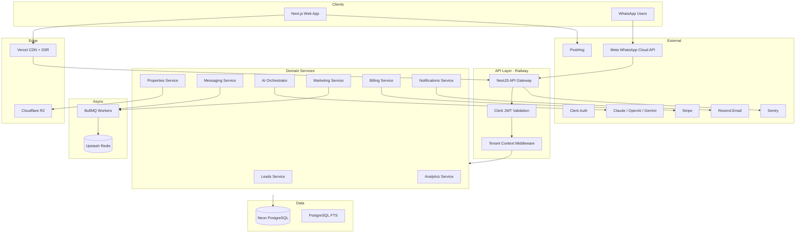

# EstateOS — System Architecture

## High-Level Topology



## Multi-Tenancy Model

**Strategy:** Shared database, **row-level tenancy** via `agency_id` on every tenant-scoped table.

| Layer | Enforcement |
|-------|-------------|
| API | `AgencyContext` from Clerk org / JWT custom claim `agencyId` |
| Prisma | Extension or middleware: auto-inject `where: { agencyId }` |
| Queries | Forbidden: any query without tenant filter on tenant tables |
| Storage | R2 prefix: `agencies/{agencyId}/...` |
| AI | All prompts include agency-scoped property + lead context only |

**Agency bootstrap:** Register → create `Agency` + `User` (owner) + default `Role` + `Subscription` (trial) + `Settings`.

## Service Boundaries (NestJS Modules)

| Module | Responsibility |
|--------|----------------|
| `auth` | Clerk webhooks, session, org sync |
| `agencies` | Workspace, branding, settings |
| `users` | Agents, invites, roles |
| `leads` | CRUD, scoring, tags, assignment |
| `messages` | WhatsApp in/out, threads, templates |
| `properties` | Inventory, media, import (CSV/Sheets) |
| `ai` | Model router, prompts, tools, audit |
| `marketing` | Posts, calendar, generation jobs |
| `appointments` | Calendar, reminders |
| `tasks` | Agent tasks from AI Command Center |
| `analytics` | Aggregates, funnels (read models) |
| `billing` | Stripe customer, usage, webhooks |
| `notifications` | Email, in-app, future push |
| `admin` | Internal super-admin (separate guard) |
| `webhooks` | Meta/Stripe/Clerk |

## AI Abstraction Layer

```
┌─────────────────────────────────────┐
│         AI Orchestrator             │
│  (use cases: qualify, recommend…)   │
└──────────────┬──────────────────────┘
               │
┌──────────────▼──────────────────────┐
│         Model Router                │
│  provider + model + fallback chain  │
└──────────────┬──────────────────────┘
               │
     ┌─────────┼─────────┐
     ▼         ▼         ▼
  Claude    OpenAI    Gemini
```

**Interface (conceptual):**

- `complete(params: CompletionRequest): CompletionResult`
- `stream(params): AsyncIterable<Chunk>`
- `embed(text): vector` (future: pgvector)

**Config per agency:** default model, max tokens, PII redaction flag, language.

## WhatsApp Pipeline

```
Inbound webhook (Meta WhatsApp Cloud API)
  → Verify signature
  → Resolve WhatsAppAccount → agencyId
  → Upsert Lead (phone) + Message (inbound)
  → Enqueue job: process-inbound-message
Worker:
  → Load conversation history (last N messages)
  → AI qualification / reply (tools: search_properties, book_appointment)
  → Persist outbound Message + update Lead fields + score
  → Notify agent if hot / handoff
  → Send via Meta API
```

All messages **immutable audit**; edits = new message row.

## Event Bus (Internal)

Use domain events via BullMQ + optional `audit_logs`:

- `lead.created`, `lead.scored`, `lead.hot`
- `message.received`, `message.sent`
- `property.imported`, `property.matched`
- `appointment.booked`
- `subscription.updated`

Analytics workers consume events for rollups.

## Security

- Clerk for auth; RBAC via `roles` + `permissions`
- API keys for agency integrations (hashed, scoped)
- Webhook secrets per provider
- Rate limits per agency (Redis)
- Sentry PII scrubbing

## Repository Layout (Monorepo)

```
estateos/
  apps/
    web/          # Next.js 15
    api/          # NestJS
  packages/
    database/     # Prisma schema + client
    shared/       # Zod schemas, types
    ai/           # Model providers (optional package)
  docs/
```

## Communication Patterns

| From → To | Pattern |
|-----------|---------|
| Web → API | REST + TanStack Query |
| API → Workers | BullMQ jobs |
| Workers → API | Direct DB / shared services |
| Real-time (later) | SSE or WebSockets for inbox |

## Scalability Notes (1 → 1000 agencies)

- Stateless API horizontal scale on Railway
- Connection pooling (Neon pooler)
- Read replicas for analytics when needed
- Heavy AI/video jobs isolated to dedicated worker dynos
- R2 + CDN for media
- FTS on PostgreSQL until search volume demands OpenSearch
