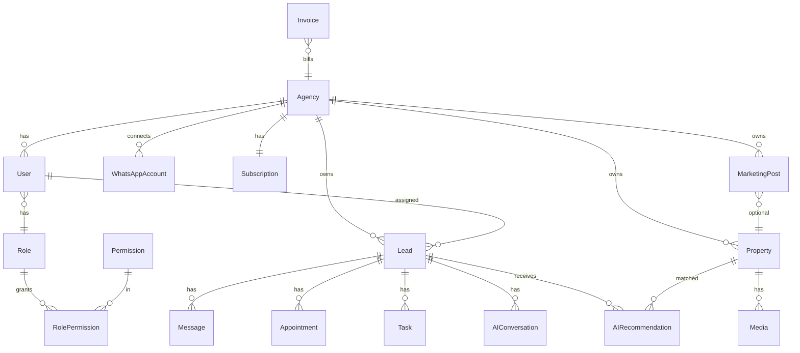

# EstateOS — Database Schema

PostgreSQL via Prisma. All tenant tables include `agency_id` unless noted.

## ER Overview



## Enums

```prisma
enum LeadStatus {
  NEW
  CONTACTED
  QUALIFYING
  QUALIFIED
  VIEWING
  NEGOTIATION
  WON
  LOST
  DORMANT
}

enum LeadTemperature {
  COLD
  WARM
  HOT
}

enum MessageDirection {
  INBOUND
  OUTBOUND
}

enum MessageChannel {
  WHATSAPP
  EMAIL
  SMS
  INTERNAL_NOTE
}

enum PropertyStatus {
  DRAFT
  AVAILABLE
  RESERVED
  SOLD
  OFF_MARKET
}

enum AppointmentStatus {
  SCHEDULED
  COMPLETED
  CANCELLED
  NO_SHOW
}

enum TaskStatus {
  TODO
  IN_PROGRESS
  DONE
  CANCELLED
}

enum TaskPriority {
  LOW
  MEDIUM
  HIGH
  URGENT
}

enum MarketingPlatform {
  INSTAGRAM
  FACEBOOK
  LINKEDIN
  X
  THREADS
}

enum MarketingPostStatus {
  DRAFT
  SCHEDULED
  PUBLISHED
  FAILED
}

enum SubscriptionStatus {
  TRIALING
  ACTIVE
  PAST_DUE
  CANCELED
  UNPAID
}

enum AIProvider {
  ANTHROPIC
  OPENAI
  GOOGLE
}
```

## Core Tables

### agencies

| Column | Type | Notes |
|--------|------|-------|
| id | uuid PK | |
| name | text | |
| slug | text unique | subdomain future |
| country | text | |
| company_size | text | |
| logo_url | text nullable | |
| primary_color | text nullable | branding |
| timezone | text default UTC | |
| clerk_org_id | text unique nullable | |
| created_at | timestamptz | |
| updated_at | timestamptz | |

### users

| Column | Type | Notes |
|--------|------|-------|
| id | uuid PK | |
| agency_id | uuid FK | |
| clerk_user_id | text unique | |
| email | text | |
| name | text | |
| phone | text nullable | |
| avatar_url | text nullable | |
| role_id | uuid FK | |
| is_active | boolean | |
| last_seen_at | timestamptz nullable | |

### roles / permissions / role_permissions

Standard RBAC. Seed: Owner, Admin, Agent, Viewer.

### subscriptions

| Column | Type | Notes |
|--------|------|-------|
| id | uuid PK | |
| agency_id | uuid FK unique | |
| stripe_customer_id | text | |
| stripe_subscription_id | text nullable | |
| plan | text | starter \| pro \| enterprise |
| status | SubscriptionStatus | |
| trial_ends_at | timestamptz nullable | |
| current_period_end | timestamptz nullable | |

### invoices

Stripe invoice mirror: agency_id, stripe_invoice_id, amount, currency, status, pdf_url, period_start, period_end.

### whatsapp_accounts

| Column | Type | Notes |
|--------|------|-------|
| id | uuid PK | |
| agency_id | uuid FK | |
| provider | text | meta_cloud_api |
| phone_number | text | E.164 |
| waba_id | text | Meta |
| is_active | boolean | |
| credentials_encrypted | jsonb | KMS later |

### leads

| Column | Type | Notes |
|--------|------|-------|
| id | uuid PK | |
| agency_id | uuid FK | indexed |
| assigned_user_id | uuid FK nullable | |
| external_id | text nullable | import |
| name | text | |
| phone | text | indexed per agency |
| email | text nullable | |
| status | LeadStatus | |
| temperature | LeadTemperature | |
| score | int 0-100 | |
| budget_min | decimal nullable | |
| budget_max | decimal nullable | |
| currency | text default AED | |
| bedrooms | int nullable | |
| preferred_areas | text[] | |
| nationality | text nullable | |
| intent | text nullable | investment \| residence |
| payment_type | text nullable | cash \| mortgage |
| timeline_days | int nullable | |
| tags | text[] | |
| source | text nullable | |
| last_message_at | timestamptz | |
| qualified_at | timestamptz nullable | |
| search_vector | tsvector | FTS |
| metadata | jsonb | |

**Indexes:** `(agency_id, status)`, `(agency_id, score DESC)`, `(agency_id, phone)` unique.

### messages

| Column | Type | Notes |
|--------|------|-------|
| id | uuid PK | |
| agency_id | uuid FK | |
| lead_id | uuid FK | |
| direction | MessageDirection | |
| channel | MessageChannel | |
| body | text | |
| media_urls | text[] | |
| provider_message_id | text nullable | |
| sent_by_user_id | uuid nullable | agent override |
| ai_generated | boolean default false | |
| created_at | timestamptz | |

### properties

| Column | Type | Notes |
|--------|------|-------|
| id | uuid PK | |
| agency_id | uuid FK | |
| title | text | |
| slug | text | unique per agency |
| description | text | |
| price | decimal | |
| currency | text | |
| bedrooms | int | |
| bathrooms | int | |
| area_sqft | decimal nullable | |
| community | text | |
| developer | text nullable | |
| amenities | text[] | |
| payment_plan | text nullable | |
| status | PropertyStatus | |
| virtual_tour_url | text nullable | |
| latitude | decimal nullable | |
| longitude | decimal nullable | |
| search_vector | tsvector | FTS |
| metadata | jsonb | |

### media

property_id, agency_id, type (image|video|document), url, r2_key, sort_order, alt_text.

### appointments

lead_id, agency_id, user_id, starts_at, ends_at, location, status, notes.

### tasks

agency_id, lead_id nullable, user_id, title, description, due_at, status, priority, source (manual|ai).

### notifications

user_id, agency_id, type, title, body, read_at, action_url, metadata jsonb.

### marketing_posts

agency_id, property_id nullable, platform, caption, hashtags, media_urls, scheduled_at, published_at, status, external_post_id.

### ai_conversations

lead_id, agency_id, provider, model, messages jsonb (or separate ai_messages), token_usage, purpose (qualification|studio|summary).

### ai_recommendations

lead_id, property_id, agency_id, score, explanation, sent_at nullable, channel.

### analytics_daily (rollup)

agency_id, date, leads_new, leads_hot, messages_in, messages_out, avg_response_seconds, appointments, conversions, revenue.

### audit_logs

agency_id nullable (null = system), user_id nullable, action, entity_type, entity_id, ip, metadata jsonb, created_at.

### settings

agency_id FK unique, jsonb blob: whatsapp, ai, notifications, security, api keys refs.

## Relationships Rules

- CASCADE delete: agency → all child tenant data (GDPR export/delete flows)
- Messages never hard-delete (compliance)
- Property delete → soft OFF_MARKET preferred

## Full-Text Search

- `leads.search_vector`: name, phone, tags, preferred_areas
- `properties.search_vector`: title, community, developer, description
- GIN indexes on search_vector

## Future Extensions

- `pgvector` on properties for semantic search
- `commission_deals` table when CRM depth increases
- `feature_flags` per agency via Flags SDK + local override table
