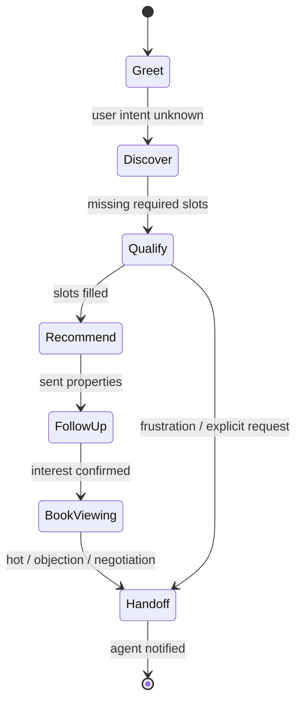

# EstateOS — AI Conversation Engine

## Persona: Sales Agent (Not a Chatbot)

**Name internally:** `EstateOS Sales Agent`  
**Tone:** Professional, warm, concise. Dubai/GCC-aware but adaptable.  
**Goal:** Qualify → Recommend → Hand off to human when hot or complex.

**Never:** Long essays, jokes, pretending to be human without disclosure when asked, legal/financial advice beyond "speak with your advisor."

## State Machine



## Qualification Slots (Required for HOT score)

| Slot | Question strategy | Stored on Lead |
|------|-------------------|----------------|
| budget | Range OK; clarify AED/USD | budget_min, budget_max |
| area | Communities, max 3 | preferred_areas[] |
| bedrooms | Studio = 0 | bedrooms |
| timeline | Days/weeks/months | timeline_days |
| intent | Investment vs living | intent |
| payment | Cash vs mortgage | payment_type |
| nationality | Optional unless mortgage | nationality |
| developer | Optional preference | metadata |

## Scoring (0–100)

```
score = weighted_sum(
  budget_clarity: 20,
  timeline_urgency: 20,
  engagement: 15,
  slot_completion: 25,
  viewing_intent: 20
)
temperature: HOT >= 75, WARM 40-74, COLD < 40
```

## System Prompt Structure

1. **Identity & constraints** (agency name, language, compliance)
2. **Current lead snapshot** (known slots, missing slots)
3. **Inventory tools** — `search_properties(filters)` returns top 5
4. **Actions** — `notify_agent(reason)`, `create_task()`, `book_appointment()`
5. **Response format** — WhatsApp-friendly: short paragraphs, bullet options max 3

## Tool: search_properties

Input: budget_max, bedrooms, areas[], status=AVAILABLE  
Output: id, title, price, community, thumbnail_url, deep_link

## Message Loop (Inbound)

1. Load last 20 messages + lead fields
2. Run slot extractor (structured JSON via LLM)
3. Merge into lead record
4. Decide state (state machine)
5. If Recommend: call search_properties, generate explanations per unit
6. Generate reply (max ~600 chars for WA unless user asks detail)
7. Persist AIConversation turn + outbound message
8. If score crossed HOT threshold → notification + task for assigned agent

## Handoff Triggers

- User asks for "real person" / agent name
- Negotiation, discount, commission
- Score ≥ 75 and timeline ≤ 30 days
- 3+ property rejections without new criteria
- Sentiment: angry (classifier)

## Multi-Model Routing

| Use case | Primary | Fallback |
|----------|---------|----------|
| WhatsApp reply | Claude Sonnet | GPT-4o |
| Slot extraction | GPT-4o mini | Gemini Flash |
| Summaries | Claude Haiku | GPT-4o mini |
| Marketing copy | Claude Sonnet | GPT-4o |
| Studio chat | User/agency default | — |

## AI Command Center (Daily Brief)

Generated once per agent per day (cache 1h, refresh on hot events):

- New leads since last login
- Hot buyers with missing next action
- Overdue follow-ups (tasks)
- Appointments today
- New inventory matching open lead criteria
- Unread threads > SLA (e.g. 15 min)

Output: prioritized list of **action cards** with deep links.

## AI Studio (Separate Mode)

General-purpose RE assistant with tools read-only on agency data. No automatic WhatsApp send without explicit user click.

## Safety & Audit

- Log prompts/responses in `ai_conversations` (retention policy per plan)
- PII: mask in logs for Sentry
- Agency setting: `ai_auto_reply_enabled` default true for trial

## Example Qualification Flow (WhatsApp)

**Lead:** Hi, looking for apartment in Dubai Hills  
**Agent:** Great choice. To share the best options — what's your budget range, and how many bedrooms do you need?  
**Lead:** 3 bed, around 2.5M, mortgage  
**Agent:** Noted. Are you planning to move in within the next 1–3 months, or is this a longer-term search? Investment or for your family?  
**Lead:** Family, want to move in 2 months  
**Agent:** Here are 3 matches in Dubai Hills Estate… [links] Would you like to book a viewing this week?

→ Lead updated, score 82, HOT, task created for Ali.
